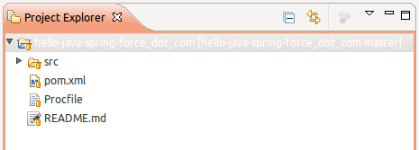
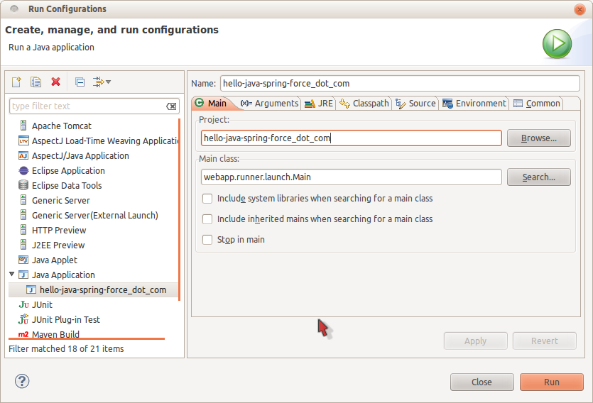
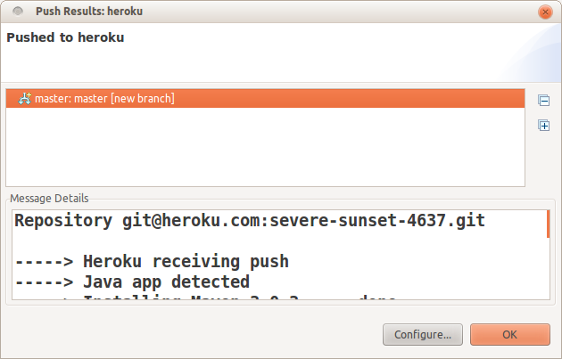

# Social Enterprise Java Apps on Heroku

Last week I co-presented a webinar about building Social Enterprise Java Apps on Heroku.  Here is the recording from the webinar:
<iframe width="640" height="480" src="http://www.youtube.com/embed/GRLzYwtzWqU?rel=0" frameborder="0" allowfullscreen></iframe>

During the webinar I showed how to create a Java web application that integrates with Salesforce.com / Force.com using the REST APIs.  In that example I started from a Tomcat + Hibernate + Spring MVC template application and then migrated the application from Hibernate to Force.com for persistence.  I'd like to take the end result of that migrated app and show how you can get started deploying Social Enterprise Java apps on Heroku.  Here are the steps we will follow:

1. Copy the `hello-java-spring-force_dot_com` project into Eclipse
2. Setup OAuth on Salesforce.com
3. Test the app locally
4. Deploy the app on Heroku

After we've completed those steps I will walk through the major pieces of the application:

* Dependencies
* `Person` Value Object
* Data Access via the `ForceAPI`
* Spring Config for OAuth
* Spring Security

Before you get started you will need to setup a few things:

1. Install the [Heroku Toolbelt](https://toolbelt.herokuapp.com)
2. [Signup for a Heroku Account](https://heroku.com/signup)
3. Install [Eclipse 3.7 for Java EE Developers](http://eclipse.org/downloads)
4. Install the EGit Eclipse Plugin

        1. In Eclipse select the "Help" menu
        2. Select "Eclipse Marketplace..."
        3. Search for "EGit"
        4. Select "Install" on the "EGit - Git Team Provider" item
        5. Complete the installation wizard

5. Install the Maven Eclipse Plugin

        1. In Eclipse select the "Help" menu
        2. Select "Eclipse Marketplace..."
        3. Search for "Maven"
        4. Select "Install" on the "Maven Integration for Eclipse" item
        5. Complete the installation wizard

6. Login to Heroku and setup SSH keys

        1. Open a command line or Terminal prompt and run:

                heroku login

        2. Enter the email address for your Heroku account and your Heroku password
        3. Follow the prompts to create (if needed) and setup a SSH key for git authentication

7. [Signup for a Salesforce.com Developer Edition Account](http://developer.force.com/join)

## Running the `hello-java-spring-force_dot_com` Demo Application

Now that your environment is all setup, lets grab a copy of the `hello-java-spring-force_dot_com` demo application by pulling it into Eclipse using EGit.

1. In Eclipse select the "File" menu
2. Select "Import..."
3. Under the "Git" item, select "Projects from Git"
4. Select "Next"
5. Select "URI" and "Next"
6. Enter the following into the "URI" field:

        git://github.com/jamesward/hello-java-spring-force_dot_com.git

7. Select "Next"
8. Select "Next" again
9. Select "Import as general project" and take note of the directory Eclipse selects for the working directory
10. Select "Next"
11. Select "Finish"

You should now see the `hello-java-spring-force_dot_com` project in the Eclipse Project Explorer view:

Now the project needs to be setup for use with Maven.  Maven will manage the dependencies for the project.

1. Right-click on the project in Eclipse
2. Select "Configure"
3. Select "Convert to Maven Project"

The project dependencies will be downloaded and the project will be configured as a web project using the dependencies specified by the Maven build.

In order to run the application locally we will need to configure OAuth on Salesforce.com.  OAuth will be used to authenticate REST requests from the application based on a handshake between Salesforce.com and the application.  OAuth is the preferred approach to integrating with Salesforce.com because it does not require storage of user credentials and it allows the user to revoke access from an application.

1. Login to [Salesforce.com](http://salesforce.com)
2. Select your name in the top right and select "Setup"
3. On the left, expand "Develop" and select "Remote Access"
4. Select "New" to create a new Remote Access Application
5. In the "Application" field specify "local-spring"
6. Specify your email address in the "Contact Email" field
7. Enter `http://localhost:8080/_auth` in the "Callback URL" field
8. Select "Save"
9. Leave the "Remote Access Detail" page open because shortly you will need some information from it

Now that OAuth is configured on Salesforce.com we can run this application locally to test it.

1. In Eclipse select the "Run" menu
2. Select "Run Configurations..."
3. Double-click on "Java Application" to create a new Run Configuration
4. In the "Name" field specify `hello-java-spring-force_dot_com`
5. In the "Main Class" field specify `webapp.runner.launch.Main`
    
6. Select the "Arguments" tab 
7. Enter "src/main/webapp" in the "Program Arguments" field
8. Select the "Environment" tab
9. Select "New"
10. Enter `OAUTH_CLIENT_KEY` in the "Name" field
11. Retrieve the "Consumer Key" value from the "Remote Access Detail" page on Salesforce.com then copy and paste it into the "Value" field
12. Select "Ok"
13. Select "New"
14. Enter `OAUTH_CLIENT_SECRET` in the "Name" field
15. Retrieve the "Consumer Secret" value from the "Remote Access Detail page then copy and paste it into the "Value" field
16. Select "Ok"
17. Select "Run" to start the application

Now that the application is up and running you can test it in your browser by visiting:  
[http://localhost:8080/](http://localhost:8080/)

The index page is unprotected and should load without having to authenticate.  Now load the "People" page by visiting:  
[http://localhost:8080/people/](http://localhost:8080/people/)

You should now be redirected to Salesforce.com's OAuth handshake page.  Select "Allow" to do the OAuth handshake.  You will then be redirected back to the "People" page which should now display a list of your Salesforce.com Contacts.  (Note: Developer Edition accounts have a few Contacts out-of-the-box.)  Test that creating and deleting contacts also works.

Now we can deploy the application on the cloud with Heroku.

1. Navigate in a command line / Terminal window to the directory containing the project
2. Create a new application on Heroku's "Cedar" stack:

        heroku create -s cedar

Your application will be assigned a name that will be used for the default HTTP and Git endpoints.  The name will be something like `severe-sunset-4637` in which case the HTTP endpoint would be `http://severe-sunset-4637.herokuapp.com` and the Git endpoint would be `git@heroku.com:severe-sunset-4637.git`.  This name can be changed and other DNS names can be pointed at the application.

Now that the application has an HTTP endpoint we will need to configure a new Remote Access Application / OAuth configuration.  Like before, create a new configuration on the Salesforce.com - Setup - Develop - Remote Access page.  This time set the "Application" field to the name of your application on Heroku.  Set the "Callback URL" field to `https://your-application-1234.herokuapp.com/_auth` making sure you specify `https` and the correct domain name for your application.  Save the new configuration.

You will now need to set the OAuth environment variables on your Heroku application.  In the command line / Terminal make sure you are in the root directory of your project and run the following commands, but replace the values with the Consumer Key and Consumer Secret values from the new "Remote Access Application" page.

    heroku config:add OAUTH_CLIENT_KEY=YOUR_CONSUMER_KEY
    heroku config:add OAUTH_CLIENT_SECRET=YOUR_CONSUMER_SECRET

Your application is ready to be deployed on Heroku!  Heroku uses Git for file transfer.  When you ran the `heroku create` command the Git endpoint for your application was added to the project's Git configuration.  To upload the application to Heroku's Git endpoint do the following:

1. In Eclipse right-click on the project
2. Select "Team"
3. Select "Remote"
4. Select "Push..."
5. In the drop-down beneath "Configured remote repository" select the remote named "heroku" that contains your applications Git endpoint
6. Select "Finish"

The application will be uploaded to Heroku where the Maven build will be run to download the dependencies and compile the application.  Once the compile has successfully completed the application will be deployed onto a [Heroku Dyno](https://devcenter.heroku.com/articles/dynos) and the application will be started.  Once that process is complete you will see the output in Eclipse:

Now test your application on Heroku by opening the "people" page in your browser using "https" as the protocol.  For instance:  
[https://severe-sunset-4637.herokuapp.com/people/](https://severe-sunset-4637.herokuapp.com/people/)

This should initiate the OAuth handshake again.  After allowing the application you should now see your contacts displayed like before, but this time from the application running on Heroku!
